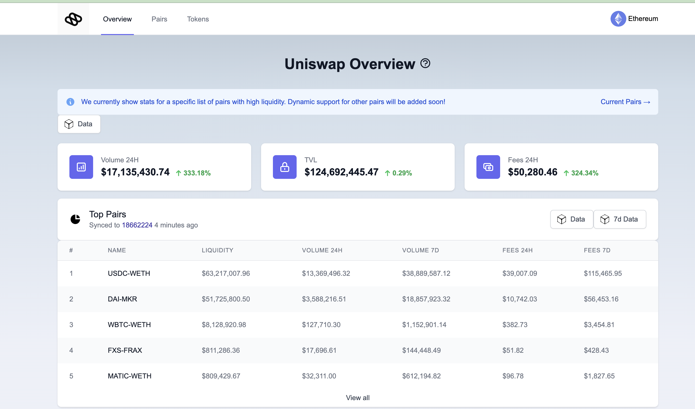

# Datapoints

### Data Points in Pooler

In Pooler, data points are specific, quantifiable elements derived from Uniswap V2 trading activities. These include:

- **Pair Reserves:** Liquidity reserves of each token in Uniswap V2 pair contracts.
- **Token Prices:** Current prices of tokens involved in trading pairs.
- **Trading Volume:** Volume of trades for different intervals (24 hours, 7 days).
- **Fees:** Fees accrued from trades over specified periods (24 hours, 7 days).
- **Top Tokens and Pairs:** Ranking based on trade volume and other metrics.
- **Daily Stats:** Summarized daily trading data such as volume, fees, and liquidity.

### Implementation

The implementation of these processes is detailed in the [Closer Inspection to Dataset Section](./closer-inspection-of-the-snapshot-datasets.md)

The specific configurations for data points like pair reserves, token prices, trading volumes, and fees are outlined in `config/projects.json` and `config/aggregator.json`. These configurations dictate what data to capture and how to process it. We have covered that in the [Fetching higher order datasets](./fetching-higher-order-datapoints.md).

