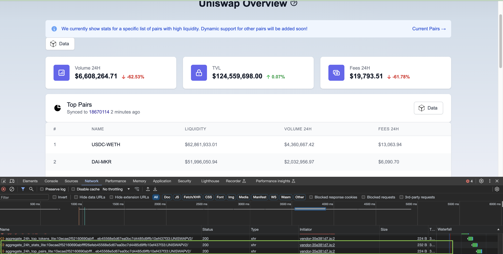
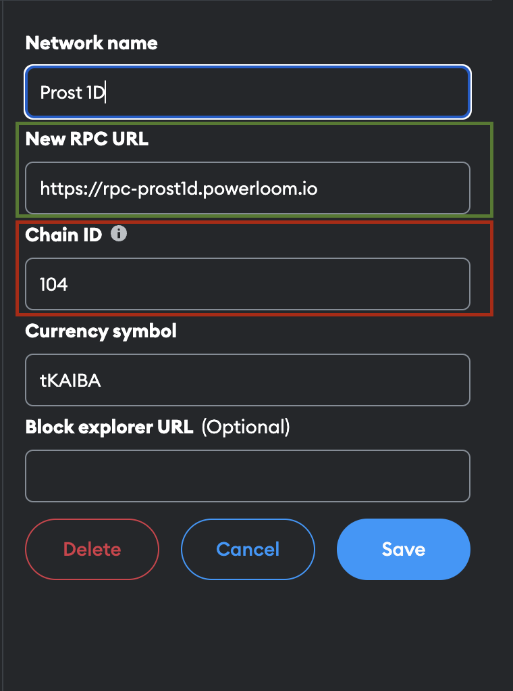
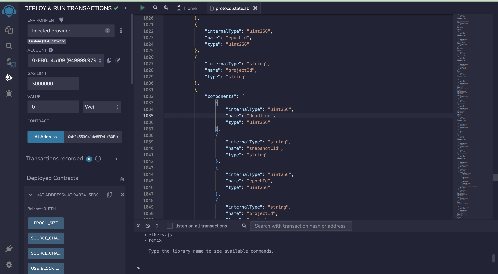

# Closer Inspection of the Snapshot Datasets

Pooler is a Uniswap V2 specific implementation in the PowerLoom Protocol, designed to capture, process, and aggregate blockchain data. This documentation provides an in-depth look at how Pooler operates and how developers can utilize it for building data-rich applications.

## Data Points Overview

Pooler focuses on several key data points:

- **Total Value Locked (TVL):** The cumulative value locked in Uniswap V2.
- **Trade Volume, Liquidity Reserves, and Fees Earned:** These are categorized by:
  - Pair Contracts
  - Individual Tokens within Pair Contracts
- **Time Aggregation:** Data is aggregated over 24-hour and 7-day periods.
- **Transaction Types:** Including Swap, Mint, and Burn events.


## Querying with CIDs

Pooler uses decentralized CIDs (Content Identifiers) to query individual pair contract projects. This is crucial for accessing reliable and decentralized data. The CIDs correspond to specific data sets, making it easier to fetch relevant information.

### Fetching CID and Verifying it On-Chain!


The Uniswap v2 dashboard at https://uniswapv2.powerloom.io/ connects to a backend hosted by the Powerloom Foundation. This backend includes a service called `core_api.py` in the 'pooler' section. This service links directly to the protocol's final state as defined in the contract.

When using the dashboard, it sends queries to the backend using project IDs. These IDs represent data summed up over periods of 24 hours and 7 days. These project IDs are also used for checking submission statistics, showing their importance in both the platform's day-to-day operations and in analyzing data.

#### Verifying the data:
To find the RPC URL for the Powerloom Prost 1D Chain and the address of the deployed protocol state contract, you need to check the `env.example` file in the Powerloom deploy repository. This file is available at the following GitHub link: [Powerloom deploy repository - env.example file](https://github.com/PowerLoom/deploy/blob/testnet_5_pairs/env.example).

**Adding the Chain to the Wallet**

Once you have these details:

1. Open MetaMask or any web3 plugin in your browser.
2. Go to the network selection area.
3. Choose to add a new network.
4. Enter the RPC URL and contract address you found in the `env.example` file.

This will allow you to connect to the Powerloom Prost 1D Chain testnet.



**Accessing the ABI of the protocol state Contract**

To access and utilize the ABI of the protocol state contract from the Powerloom project, follow these steps:

1. Visit the Powerloom 'pooler' repository on GitHub at this URL: [Powerloom pooler repository - ProtocolContract.json](https://github.com/PowerLoom/pooler/blob/main/snapshotter/static/abis/ProtocolContract.json).
2. Locate the `ProtocolContract.json` file.
3. Copy the contents of the file.
4. Open the Remix IDE.
5. Create a new file with a `.abi` extension.
6. Paste the contents of the `ProtocolContract.json` file into this new file.
7. Save the file in Remix.

This process will allow you to have the protocol state contract’s ABI available in the Remix editor for further development or interaction.


**Verify Uniswap v2 dashboard datasets**

To verify the top 24-hour aggregation on pair contract activity for the specified project ID in the Uniswap V2 ecosystem, follow these steps:

1. Identify the last finalized epoch associated with the project ID: `aggregate_24h_top_pairs_lite:10ecae2f52160690abffff26efeb45568e5d67ea0bc7d4485d9ffb10ef437f33:UNISWAPV2`.
2. Retrieve the finalized CID (Content Identifier) for this epoch.
3. Access the dataset linked to this CID. You can do this either through your local IPFS node or by using a public IPFS gateway.(Public gateway link: https://ipfs.io/ipfs/{IPFS-CID})

:::tip
Sometimes, the IPFS gateway can be overloaded and it can result in not giving out an output. In that case, you can tunnel into your node and verify the data. 

```bash
ssh -nNTv -L 5001:127.0.0.1:5001 root@yourServerIP
```

```bash
ipfs cat bafkreifc33xiuqaf5nxqad2syn7j5x27j2pujzr7hhsxgtsr7zor4svqie --api /ip4/127.0.0.1/tcp/5001
```
:::

This process will allow you to review the aggregated data for the top pairs on Uniswap V2 over the last 24 hours.

## Extracting Base Snapshots: Trade Data Logic

:::info
Before you dive into this section, please make sure you take a look into the [Project Configuration Section](./fetching-higher-order-datapoints.md#project-configuration)
:::

In the last section, we explored how to get data from the protocol state contract and see it in JSON format through the IPFS Gateway. Next, we're going to explore how trade data is processed in basic snapshots.

Our Pooler system has several classes that handle the hard work of processing and ensuring the data is correct. One of these classes is `TradeVolumeProcessor`, located in the **Snapshotter-compute** Repo (eth_uniswapv2 branch)[`snapshotter-computer/aggregate/single_uniswap_trade_volume_24h.py`](hhttps://github.com/PowerLoom/snapshotter-computes/blob/eth_uniswapv2/aggregate/single_uniswap_trade_volume_24h.py). This class uses the `GenericProcessorSnapshot` structure found in [`snapshotter/utils/callback_helpers.py`](https://github.com/PowerLoom/pooler/blob/main/snapshotter/utils/callback_helpers.py).


If you are planning to write your own extraction logic, here are few quick concepts that are crucial:
The `compute` function is the main part where we create and process snapshots. It uses these inputs:

- `epoch`: Gives details about the current epoch.
- `redis`: Connects to Redis asynchronously.
- `rpc_helper`: Assists with blockchain requests.

Additionally, `transformation_lambdas` are used for extra calculations on the snapshot, if needed. If `compute` does everything, set `transformation_lambdas` to an empty list (`[]`). If not, add a list of functions. These functions should all accept a snapshot, a contract address, and the start (`epoch_begin`) and end (`epoch_end`) blocks of the epoch.


```python reference
https://github.com/PowerLoom/snapshotter-computes/blob/74b2eaa452bfac8c0e4e0a7ed74a4d2748e9c224/aggregate/single_uniswap_trade_volume_24h.py#L110-L120
```
The format of the output data can vary based on what you need it for. However, it's a good idea to use [`pydantic`](https://pypi.org/project/pydantic/) models, as they help organize and define the data structure clearly.

:::info
Pydantic Model is a Python Library that helps data validation and parsing, by using Python type annotations.
:::


In this example related to Uniswap V2, the output is a data model named `UniswapTradesSnapshot`. This model is defined in a specific section of the Pooler code, located in the Snapshotter Compute repository (eth_uniswapv2 branch) [`utils/models/message_models.py`](https://github.com/PowerLoom/snapshotter-computes/blob/eth_uniswapv2/utils/models/message_models.py).

```python reference
https://github.com/PowerLoom/snapshotter-computes/blob/74b2eaa452bfac8c0e4e0a7ed74a4d2748e9c224/utils/models/message_models.py#L47-L55
```

The `TradeVolumeProcessor` collects and stores information about trades that happen within a specific range of blocks in the blockchain, known as the epoch. This range is defined by the lowest block number (`min_chain_height`) and the highest block number (`max_chain_height`) in that epoch.

## 24-Hour Trade Volume Aggregates for Individual Pair Contracts

-  As we explored in the previous section, the  `TradeVolumeProcessor`  logic takes care of capturing a snapshot of information regarding Uniswap v2 trades between the block heights of  `min_chain_height`  and  `max_chain_height`.
    
-   The epoch size as described in the prior section on  [epoch generation](../../../Protocol/Specifications/Epoch.md)  can be considered to be constant for this specific implementation of the Uniswap v2 use case on PowerLoom Protocol, and by extension, the time duration captured within the epoch.
    
-   The finalized state and data CID corresponding to each epoch can be accessed on the smart contract on the anchor chain that holds the protocol state. The corresponding helpers for that can be found in  `get_project_epoch_snapshot()`  in  [`pooler/snapshotter/utils/data_utils.py`](hhttps://github.com/PowerLoom/pooler/blob/main/snapshotter/utils/data_utils.py)

```python reference

https://github.com/PowerLoom/pooler/blob/fc08cdd951166ab0cea669d233cd28d0639f628d/snapshotter/utils/data_utils.py#L273-L295

```

To figure out the end point (or tail) for a 24-hour period of snapshots and trade data, starting from a given epoch ID (the beginning or head of this time span), we use a specific formula.

```
time_in_seconds = 86400
tail_epoch_id = current_epoch_id - int(time_in_seconds / (source_chain_epoch_size * source_chain_block_time))
```

```python reference 

https://github.com/PowerLoom/pooler/blob/fc08cdd951166ab0cea669d233cd28d0639f628d/snapshotter/utils/data_utils.py#L507-L546
```

The worker class for such aggregation is defined in  `config/aggregator.json`  in the following manner:

```json reference 
https://github.com/PowerLoom/snapshotter-configs/blob/ae77941311155a9126205af08735c3dfa5d72ac2/aggregator.example.json#L3-L10

```

Each finalized `epochId` is registered with a snapshot commit against the aggregated data set generated by running summations on trade volumes on all the base snapshots contained within the span calculated above. 

## Extending Pooler for more Datapoints. 

Implementing custom data points on top of existing pooler is easy. We have a section in [Build with Powerloom](../../build-with-powerloom.md) which covers this in detail. 