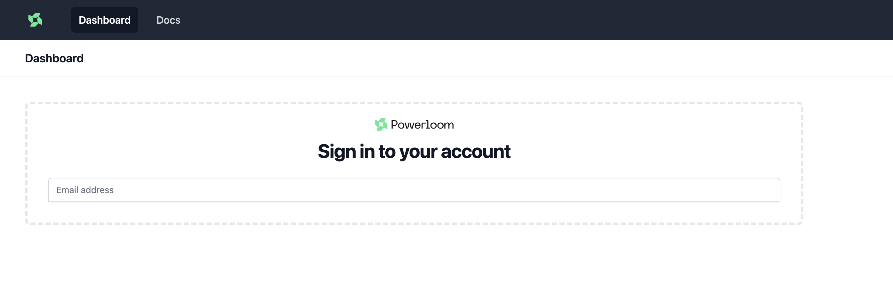
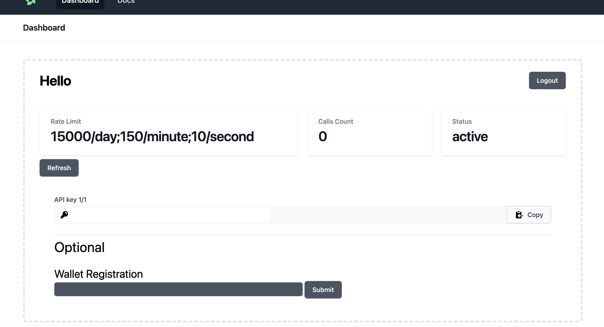
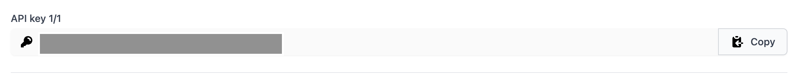

# ETHIndia 2023 - Getting Started

If you are building at [ETHIndia 2023](https://ethindia.co), we have a dedicated dashboard to get you started. 

[EthIndia 2023 Dashboard](https://ethindia23.powerloom.io)

If you intend to operate a snapshotter node, upon registration, you will be directed to a screen where you can add your wallet.

If your wallet is not added in 10-15 mins, you can reach us out on [Discord](https://docs.powerloom.io/docs/category/snapshotter-core-api).

## API key: 

If you are planning to use APIs to access on-chain data. You can access the APIs documentation [here](https://docs.powerloom.io/docs/category/snapshotter-core-api).

When you register on the dashboard, The API key is auto-generated and you use that to Authenticate and increase the rate-limit of the API calls. 